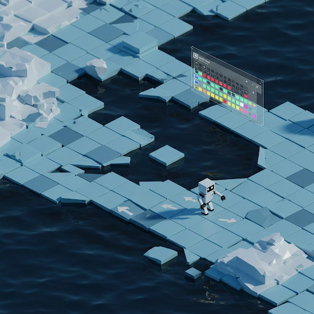

# Reinforcement Learning Demo: Frozen Lake

  

This project demonstrates a Reinforcement Learning (RL) agent learning to navigate a Frozen Lake environment using the Q-learning algorithm. The agent's goal is to reach the goal state without falling into any holes.

## The Frozen Lake Game

Imagine a grid-like frozen lake. Your agent (a learning entity) starts at the top-left corner and needs to reach the bottom-right corner, which is the goal.

Here's the challenge:

* **Frozen Surface:** The lake is icy, so the agent can slip and slide, potentially moving in a direction different from the one it intended.
* **Holes:** Some tiles on the lake have holes. If the agent falls into a hole, it fails.
* **Start and Goal:** The top-left is the starting point, and the bottom-right is the goal.
* **Actions:** The agent can move in four directions: up, down, left, and right.

**The Goal:**

The agent's goal is to learn the optimal path to reach the goal without falling into any holes.

## How the Program Works

This program uses Q-learning, a reinforcement learning algorithm, to train the agent to navigate the Frozen Lake.

1.  **Environment Setup:**
    * A grid-like representation of the lake is generated, with 'S' for start, 'G' for goal, 'H' for holes, and 'F' for frozen tiles.
    * Functions convert between the agent's position (row, column) and a single numerical state representation.
    * A function simulates the agent's movement, returning the next state, reward, and whether the episode is done.

2.  **Q-Learning Agent:**
    * A Q-table stores the estimated value of taking each action in each state.
    * The agent selects actions based on the Q-table and an exploration-exploitation strategy.
    * The Q-table is updated based on the reward received and the next state.

3.  **Training:**
    * The agent plays multiple episodes of the game.
    * The agent updates its Q-table after each step.
    * The exploration rate decreases over time.

4.  **Visualization:**
The visualization of the agent's learned policy uses arrows to represent the optimal action the agent should take in each state.

* **Arrows:** Each arrow indicates the direction the agent should move when it's in the corresponding cell.
    * **Left:** An arrow pointing left.
    * **Down:** An arrow pointing down.
    * **Right:** An arrow pointing right.
    * **Up:** An arrow pointing up.
* **Grid:** The grid represents the Frozen Lake environment. Each cell in the grid corresponds to a state (a position) on the lake.
* **Interpretation:** By following the arrows from the starting cell (top-left) to the goal cell (bottom-right), you can trace the agent's learned path to reach the goal without falling into any holes.

The agent has learned to navigate the lake by determining the optimal action for each state, maximizing its chances of reaching the goal.

## Hyperparameters

The agent's performance is highly dependent on the choice of hyperparameters. The following values were used to achieve successful goal completion:

* **Learning Rate:** 0.28
* **Discount Factor:** 0.91
* **Exploration Decay:** 0.01
* **Episodes:** 1563

These values were found through a combination of experimentation and observation. It is encouraged to try different values to observe the effects on the agent's learning.

## Web Application

You can access the interactive web application here:

[https://learning-agent-gvbe2djypfdmoid5vrkbsa.streamlit.app/](https://learning-agent-gvbe2djypfdmoid5vrkbsa.streamlit.app/)

The web app allows you to interact with the Frozen Lake environment, adjust hyperparameters, and visualize the agent's learned policy.

## Project Files

* `rl_agent.py`: Contains the Q-learning agent implementation.
* `app.py`: Contains the frozen lake environment and the Streamlit web application code.
* `README.md`: This file.

## How to Run

1.  Clone the repository.
2.  Install the required dependencies: `pip install streamlit numpy matplotlib`
3.  Run the Streamlit app: `streamlit run app.py`

Enjoy exploring Reinforcement Learning!
